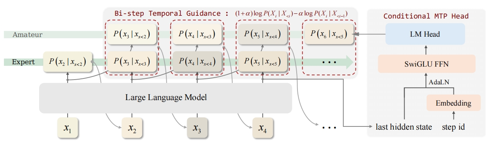

<div align="center">

# Temporal Guidance for Large Language Models

[](https://arxiv.org/abs/2601.21744) [](https://www.python.org/downloads/release/python-310/) [](LICENSE)

*A highly efficient method for guiding large language models along the temporal dimension*



</div>

---

## 💡 Introduction

We propose **Temporal Guidance (TeGu)**, a efficient contrastive decoding method that leverages temporal prediction differences within a single language model. TeGu contrasts the current next-token prediction with past multi-token predictions that lack recent context, eliminating the need for external models or layer-wise heuristics. With a minimal **Conditional MTP Projector (cMTPP)**, TeGu introduces negligible overhead while consistently improving reasoning, coding, and instruction-following performance.

---

## 🚀 Getting Started

### Environment Setup

```bash
mamba create -n tegu python=3.10 -y
mamba activate tegu
pip install uv
uv pip install torch==2.4.0 torchvision==0.19.0 torchaudio==2.4.0 --index-url https://download.pytorch.org/whl/cu124
uv pip install transformers peft datasets tqdm numpy accelerate
uv pip install flash-attn --no-build-isolation
```

## 🔧 Using TeGu on General LLMs

### Training cMTPP

To train the Conditional MTP Projector (cMTPP), run the following command. Please replace `/path/to/data` with your local path containing `.parquet` files.

```bash
deepspeed --num_gpus=8 train_cmtp.py --model_name "Qwen/Qwen3-8B" --data_path "/path/to/data"
```

### Inference with TeGu

```python
import torch
from transformers import AutoModelForCausalLM, AutoTokenizer, infer_device
from cmtp_model import LLMWithCMTP

model_path = "Qwen/Qwen3-1.7B"
cmtpp_path = "cmtpp_weights/cmtpp_Qwen3-1.7B.bin"

tegu_custom_generate_path = "./tegu"
mtp_alpha = 0.3

text = "The earliest records of kitsune can be traced back to"

device = infer_device()
tokenizer = AutoTokenizer.from_pretrained(model_path)
model = LLMWithCMTP(model_path=model_path, torch_dtype=torch.float16).to(device)
model.load_mtp_projector(cmtpp_path)

inputs = tokenizer(text, return_tensors="pt").to(device)

outputs = model.generate(
    **inputs,
    max_new_tokens=128,
    do_sample=False,
    custom_generate=tegu_custom_generate_path,
    trust_remote_code=True,
    mtp_alpha=mtp_alpha,
    future_offsets_comb_idx=0
)

print(tokenizer.batch_decode(outputs, skip_special_tokens=True))
```


## 📱 Using TeGu on MiMo

### Inference with TeGu

First replace the original `modeling_mimo.py` file in your local MiMo repository with the provided `modeling_mimo.py` in this repo. And then you can:

```python
import torch
from transformers import AutoModelForCausalLM, AutoTokenizer, infer_device

model_path = "XiaomiMiMo/MiMo-7B-SFT"

tegu_custom_generate_path = "./tegu_mimo"
mtp_alpha = 0.3

text = "The earliest records of kitsune can be traced back to"

device = infer_device()
tokenizer = AutoTokenizer.from_pretrained(model_path)
model = AutoModelForCausalLM.from_pretrained(model_path, torch_dtype=torch.float16, trust_remote_code=True).to(device)

inputs = tokenizer(text, return_tensors="pt").to(device)

outputs = model.generate(
    **inputs,
    max_new_tokens=128,
    do_sample=False,
    custom_generate=tegu_custom_generate_path,
    trust_remote_code=True,
    mtp_alpha=mtp_alpha
)

print(tokenizer.batch_decode(outputs, skip_special_tokens=True))
```

---

## 📁 Core Files

- `train_cmtp.py`: Used for training the Conditional MTP Projector (cMTPP).
- `cmtp_model.py`: The `LLMWithCMTP` class encapsulates the LLM itself and the cMTPP module. During training, only the cMTPP module is saved. During inference, you need to load the cMTPP module weights separately. The `forward` method of `LLMWithCMTP` is used exclusively for training, while the `get_future_logits` method is used during inference to obtain the logits of future tokens.
- `tegu/custom_generate/generate.py`: The implementation of the TeGu inference process.
- `modeling_mimo.py`: Modified based on `modeling_mimo.py` from the [official MiMo Hugging Face repository](https://huggingface.co/XiaomiMiMo/MiMo-7B-SFT) to support returning MTP logits.
- `tegu_mimo/custom_generate/generate.py`: The implementation of the TeGu inference process on MiMo.

---

## 🙏 Acknowledgement

Thanks to [transformers-community/dola](https://huggingface.co/transformers-community/dola) for their wonderful codebase!

---

## 📝 Citation

If you find our work inspiring, please consider citing:

```bibtex
<todo>
```